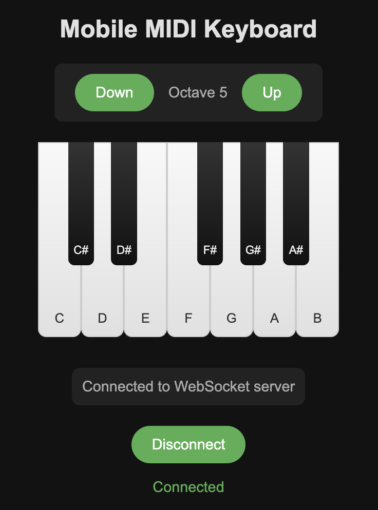

# 🎹 MIDI over USB on ESP32-S3 with Embassy (Async Rust)

> Send MIDI Note On/Off events via USB from your ESP32-S3 using async Rust and Embassy. Use buttons, GPIO, WiFi etc.

This example demonstrates how to build a **USB MIDI device** on the ESP32-S3 using **async Embassy**, with **serial logging** via CDC-ACM and **button-triggered** and **WiFi** triggered **MIDI notes**. Press the onboard **BOOT button** to send a MIDI note (C3) to any host device like GarageBand, Ableton, or DAWs. Connect to WiFi network `ESP32 MIDI` to get a MIDI keyboard **web interface** which sends notes via **WebSocket**.

---

## ✨ Features

| Feature | Description |
|--------|-------------|
| 🎵 **USB MIDI Device** | Sends `Note On` and `Note Off` messages over USB MIDI (Cable 0) |
| 🔌 **CDC-ACM Serial Logging** | Real-time logs via USB serial port (`log!` macros) |
| 🎛️ **Button Triggered** | Uses the ESP32-S3’s built-in `BOOT` button (GPIO0) |
| 🛜 **WiFi Web App** | Connect your phone to open a web app and send MIDI notes |
| ⚡ **Async-First** | Clean, readable async code with `await` — no busy loops or RTOS tasks |
| 📦 **No External Libraries** | Uses only `embassy`, `esp-hal`, and `midi-convert` |

---

## 📁 Project Structure

```bash
`midi.rs`               # 🚫 Legacy: Blocking (non-async) version for comparison
`midi_async.rs`         # ✅ Better: Async Embassy version (this example)
`midi_wifi.rs`          # 🛜 Advanced: Host a WiFi Access Point and presents a web app via captive portal. Demostrates WebSocket communication
```

---

## 🤔 Why Use Async?

Async Rust lets you write **clean, sequential logic** that feels like blocking code — but runs concurrently without threads or RTOS overhead.

```rust
loop {
    button.wait_for_low().await;        // Wait for button press — no polling!
    log::info!("Button pressed → Note On");
    send_midi_note(midi_class, true).await?;

    button.wait_for_high().await;       // Wait for release — natural flow!
    log::info!("Button released → Note Off");
    send_midi_note(midi_class, false).await?;
}
```

✅ No interrupts.  
✅ No state machines.  
✅ No `while !button.is_pressed()` loops.  
✅ Just **readable, linear logic** that the compiler optimizes into efficient async code.

---

## 🛠️ First-Time Setup

Make sure you have the right tools installed:

```bash
# Install Rust toolchain and ESP tooling
sudo apt update && sudo apt install -y rustup tio
# On macOS
brew install rustup tio

rustup install stable
cargo install espup

# Install ESP32 toolchain
espup install
```

---

## ▶️ Running the Examples

>   ⚠️ **NOTE** - You will need to hold down the BOOT button whilst plugin in the ESP32 (or whilst pressing reset). This is due to the loss of the default debugging interface - a necessary sacrifice needed to bring up the Embassy USB stack.

Build and flash in release mode:

```bash
cd firmware

./run-midi.sh   # Example using BOOT button
./run-wifi.sh   # WiFi example (advanced)
```

### 🔌 Connect & Test

1. Plug your ESP32-S3 into your computer via USB.
2. Wait 2–3 seconds for the device to enumerate.
3. Open a **MIDI-compatible app**:
   - **macOS**: GarageBand, Logic Pro, MIDI Monitor
   - **Linux**: `aconnect -i` + `qjackctl` or `midisnoop`
   - **Windows**: MIDI-OX, VCV Rack

> ✅ You should see **MIDI events** appear when you press the **BOOT button** (labeled `BOOT` or `GPIO0` on your board).

#### For the WiFi example:

1. Connect your phone to the WiFi network `ESP32 MIDI`.
2. App should appear. If not, open `192.168.1.1` on your phones web browser.
3. Press keys to send MIDI notes.



### 📜 View Serial Logs (Debugging)

The device also creates a **virtual serial port (CDC-ACM)** for logs.

```bash
tio /dev/ttyUSB0
```

On macOS, use:

```bash
tio /dev/cu.usbmodem123456783
```

> ⚠️ If `/dev/ttyUSB0` doesn’t work, try `ttyUSB1`, `ttyACM0`, or use:
> ```bash
> ls /dev/tty* | grep -E "(USB|ACM)"
> ```

Logs will show:
```
Wifi: Hello [70, 101, 32, 53, 76, 106]
Upgrade WebSocket connection...
WebSocket opened
Message: Text("{\"NoteOn\":64}")
Message: Text("{\"NoteOff\":64}")
Message: Text("{\"NoteOff\":64}")
Message: Text("{\"NoteOn\":65}")
Message: Text("{\"NoteOn\":65}")
```

> 💡 To **restart the device**, type `r` + Enter in the serial terminal!

---

## 🧩 How It Works

| Component | Role |
|---------|------|
| **USB MIDI Class** | Implements USB MIDI protocol over bulk endpoints. |
| **CDC-ACM Class** | Provides serial logging via USB (like Arduino Serial). |
| **Button (GPIO0)** | Pulled high; goes low when pressed. |
| **`midi-convert`** | Converts Rust MIDI messages (`NoteOn`, etc.) into raw 3-byte MIDI data. |
| **`usbd-midi`** | Wraps MIDI data into USB MIDI event packets (4-byte format). |
| **`embassy`** | Async USB stack — handles all USB protocol details for you. |

### WiFi example

This works by abusing the captive portal function of your device, usually used to get you to pay for internet access (i.e. in a hotel or airport). This allows the app to be presented immediately upon connecting the WiFi network.

WiFi example also demostrates:

- Access Point mode
- DHCP Server
- WebSocket server
- Embassy channels for internal communication
